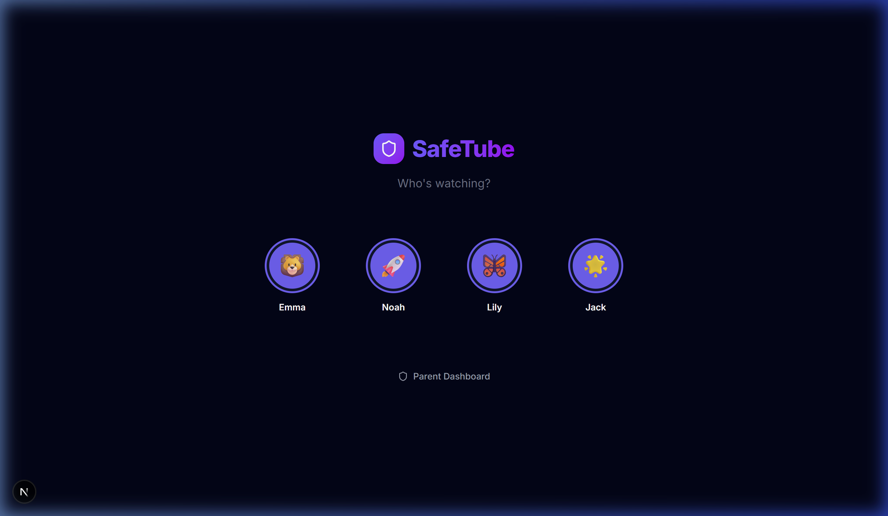
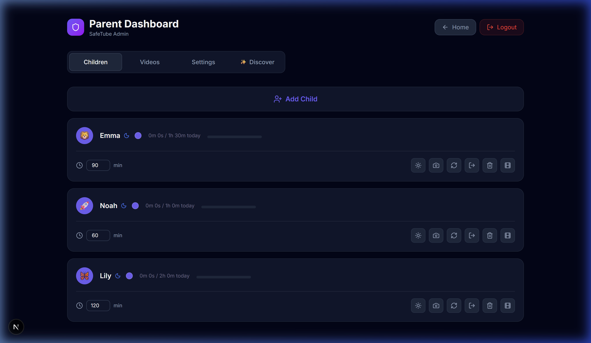
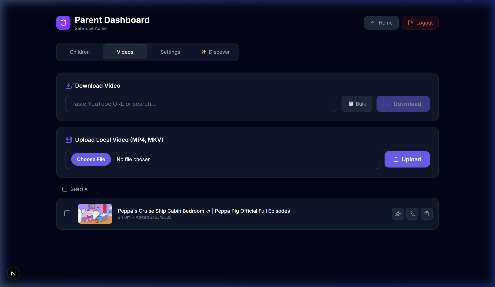
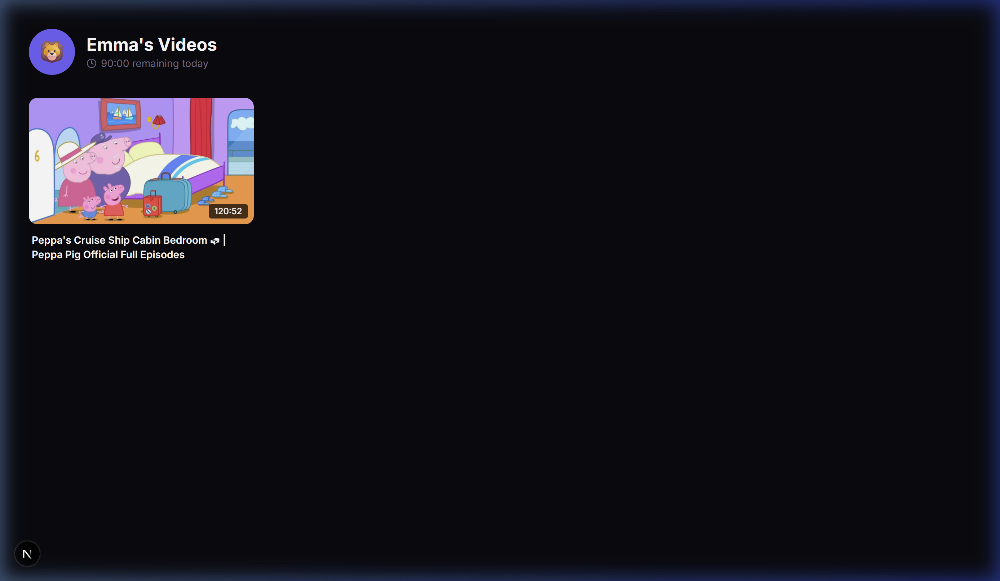

# 🛡️ SafeTube Local

<p align="center">
  
  
  
  
  
  
  
  
</p>

**Secure · Offline · Kid-safe**

SafeTube is a self-hosted web application designed for parents who want absolute control over the content their children watch. It allows you to download YouTube videos or upload local files, serving them in a distraction-free, algorithm-free environment with ironclad screen time limits.

---

### 🚀 Key Features

- **🔒 Complete Control**: No recommendations, no ads, no "infinite scroll". Only parent-approved videos.
- **⏱️ Anti-Cheat Time Tracking**: Heartbeat-based tracking ensures screen time is only deducted during active playback.
- **📥 Local Storage**: High-speed local playback with no external streaming required.
- **💬 Subtitle Support**: Automatic conversion of `.srt` to `.vtt` for seamless accessibility.
- **🤖 AI Content Analysis**: Automatically score video safety, educational value, and pacing before downloading — powered by your choice of AI provider (OpenAI, Anthropic, Google Gemini, or a local Ollama model).
- **🐳 One-Click Deploy**: Fully dockerized. Node.js, Python, and FFmpeg ready out of the box.

---

### 📸 Visual Walkthrough

<details>
<summary><b>1. Simple Profile Selection</b></summary>
<br>

<p><i>Symmetric, easy-to-use profile selection for up to 4 children (expandable).</i></p>
</details>

<details>
<summary><b>2. Parent Dashboard (Children & Limits)</b></summary>
<br>

<p><i>Manage daily screen time, avatars, and active sessions for each child.</i></p>
</details>

<details>
<summary><b>3. Content Discovery & Uploads</b></summary>
<br>

<p><i>Download directly from YouTube or upload local MP4/MKV files with metadata extraction.</i></p>
</details>

<details>
<summary><b>4. Child's Safe Library</b></summary>
<br>

<p><i>A clean grid of parent-approved content. Once time expires, playback stops immediately.</i></p>
</details>

---

## 🤖 Intelligence & AI

SafeTube integrates an **optional AI analysis layer** that reviews each video *before* it is downloaded, giving you a structured safety report you can accept or dismiss.

### How It Works

When **AI Auto-Analysis** is enabled, the download workflow changes:

```
Parent pastes URL  →  yt-dlp fetches metadata & auto-subtitles (no download yet)
                   →  Transcript is cleaned & sent to your chosen LLM
                   →  AI returns a structured JSON report
                   →  You review the report in the dashboard
                   →  ✅ Approve  →  video downloads and appears in children's library
                      ❌ Dismiss  →  video is discarded, nothing is downloaded
```

The AI report includes:

| Field | Description |
|---|---|
| **Safety Score** | 1–10 (10 = perfectly safe for young children) |
| **Educational Value** | Short description, e.g. *"High — teaches basic physics"* |
| **Pacing** | `Very Slow/Calm` → `Hyper-Stimulating` |
| **Tags** | Topic labels (e.g. `science`, `animals`, `crafts`) |
| **Summary** | 2–3 sentence rationale from the model |

### Supported AI Providers

| Provider | Requires API Key | Privacy | Notes |
|---|---|---|---|
| **OpenAI** | ✅ Yes | ☁️ Cloud | GPT-4o, GPT-4o-mini, etc. |
| **Anthropic** | ✅ Yes | ☁️ Cloud | Claude 3.5 Sonnet / Haiku |
| **Google Gemini** | ✅ Yes | ☁️ Cloud | Gemini 2.0 Flash, 1.5 Pro |
| **Ollama** (local) | ❌ No | 🏠 100% local | Any model you pull — no data leaves your machine |

> **Privacy tip:** Choose Ollama if you don't want any video content or transcript data sent to third-party cloud APIs. Everything stays on your local network.

### Configuring AI (Admin Dashboard)

1. Open the **Admin Dashboard** → **Settings** → **Intelligence & AI**.
2. Choose your **Provider**.
3. Enter your **API Key** (not needed for Ollama).
4. Select or type a **Model** name (a live list is fetched from the provider's API).
5. For Ollama, set the **Ollama URL** (default: `http://localhost:11434`).
6. Toggle **Auto-Analysis on Download** and/or **Video Recommendations**.
7. Hit **Test Connection** to verify everything works before saving.

API keys are stored **encrypted at rest** using AES-256-GCM with a randomly generated encryption key (stored in `data/.encryption-key`). The key is created automatically on first boot.

### Running Ollama via Docker (Recommended)

The included `docker-compose.yml` starts an Ollama container automatically alongside SafeTube. No manual installation needed.

```bash
# 1. Start everything
docker compose up --build -d

# 2. Pull a model (run once; persisted in the ollama_models Docker volume)
docker exec safetube-ollama ollama pull llama3.2

# 3. Open SafeTube → Admin → Settings → Intelligence & AI
#    Provider: Ollama  |  URL: http://ollama:11434  |  Model: llama3.2
```

**GPU acceleration (optional):** Uncomment the `deploy → resources` block in `docker-compose.yml` and ensure the [NVIDIA Container Toolkit](https://docs.nvidia.com/datacenter/cloud-native/container-toolkit/) is installed on your host.

If you already run Ollama directly on your host (not in Docker), set the URL to `http://host.docker.internal:11434` instead.


## 🛠️ Quick Start (Docker)

1.  **Clone & Launch**
    ```bash
    git clone https://github.com/your-username/safetube.git
    cd safetube
    docker compose up --build -d
    ```
2.  **Access App**: Open `http://localhost:3000`.
3.  **Parent Login**: Click **Parent Dashboard** at the bottom. On first boot, a random 6-digit PIN is generated and printed to the Docker logs:
    ```bash
    docker logs safetube-app
    # Look for: ┌──────────────────────────────────────┐
    #           │  Your initial admin PIN is: XXXXXX   │
    #           └──────────────────────────────────────┘
    ```
    Change this PIN immediately in **Settings → Change PIN**.

---

## 🔐 Security Architecture

### The Beacon (Heartbeat Tracking)

SafeTube uses a "Beacon" mechanism. The player sends a heartbeat every 5 seconds. If the child hasn't reached their limit, the heartbeat is accepted and usage is incremented. If the limit is hit, the server rejects the request, and the UI immediately locks the player. This is significantly more robust than client-side-only timers.

### PIN Hashing

Admin PINs are secured using **scrypt** hashing with per-user salts. A random 6-digit PIN is generated on first boot (printed to logs). Brute-force protection is built-in with automatic rate-limiting (5 attempts per minute).

### Session Security

- **Admin sessions** are stored server-side in the database and validated on every request. Session IDs are random UUIDs with 4-hour expiry.
- **Child sessions** are stored in the database with 24-hour expiry and validated against session ID, not just cookie existence.
- All session cookies are `HttpOnly`, `SameSite=Strict`, and `Secure` in production.

### Content Security

- **Media files** are served only to authenticated users (child or admin session required).
- **Path traversal protection** on all file-serving routes using `path.resolve()` validation.
- **URL validation** ensures only YouTube URLs are passed to `yt-dlp` (prevents SSRF).
- **CSP headers** with strict `script-src 'self'` policy.
- **Error Boundaries** prevent component crashes from taking down the entire application.

---

## ⚙️ Configuration & Cookies

If you encounter **"Sign in to confirm you're not a bot"** or want to download **age-restricted content**, paste your `cookies.txt` (Netscape format) into **Admin Dashboard → Settings → YouTube Configuration**. SafeTube will use your session to authenticate downloads.

---

## 🗂️ Project Structure

```bash
SafeTube/
├── src/app/          # Next.js App Router (Pages & API)
├── src/components/   # Reusable React components
├── src/db/           # Drizzle ORM Schema & SQLite
├── src/lib/          # Server actions, Auth, & Video Downloader
├── public/           # Static assets & screenshots
├── scripts/          # Cleanup & maintenance scripts
└── Dockerfile        # Production container definition
```

---

## 📜 License

MIT — Fork it, build on it, share it.
